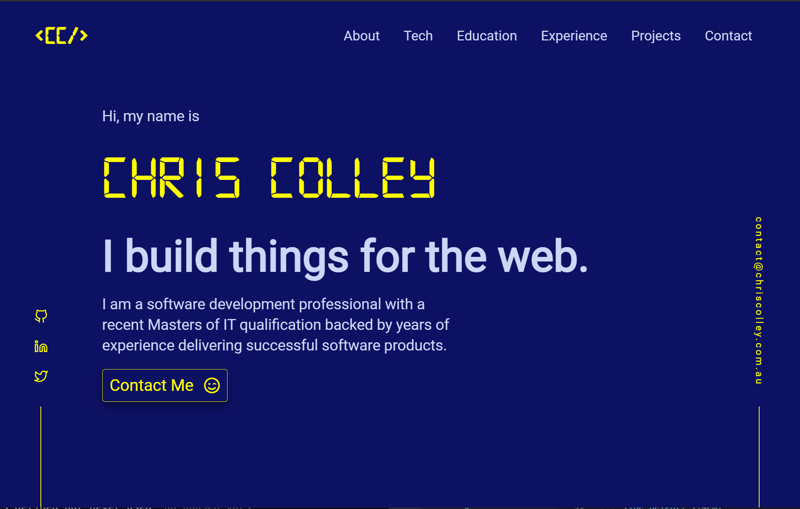

<p align="center">
  <a href="https://www.chriscolley.com.au">
    
  </a>
</p>
<h1 align="center">
  <a href="https://www.chriscolley.com.au">
    chriscolley.com.au
  </a>  
</h1>



Deployed on [Gatsby Cloud](https://www.gatsbyjs.com/cloud/)

This is version 1 of my Web Developer Portfolio site

## Technology Used

- Built with [Gatsby](https://www.gatsbyjs.org/)
- React
- Styled-components
- Framer Motion for animations
- ScrollReveal for scrolling animations

## How To Use 

From your command line:

```bash
# Install the Gatsby CLI
$ npm install -g gatsby-cli

# Install dependencies
$ npm install

# Start's development server
$ gatsby develop
```

Your site is now running at http://localhost:8000!

